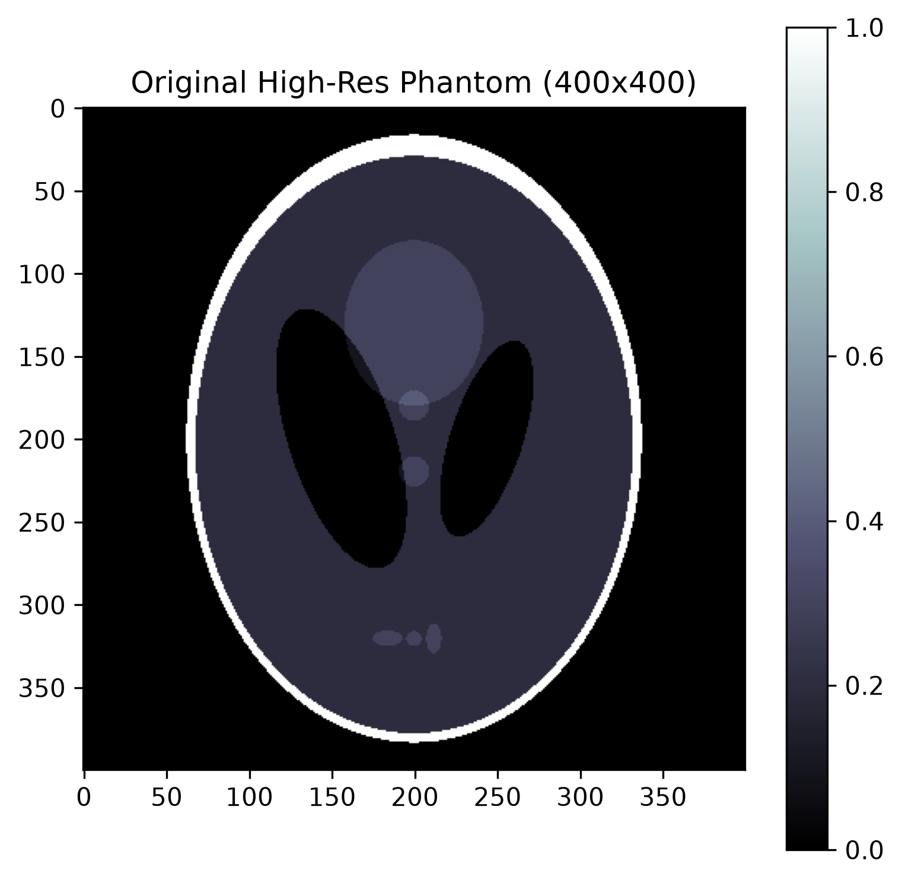

### Synthetic Phantom Testing
First, we began by testing the quantum reconstruction algorithm on a mathematically generated phantom image from skimage.data starting with a downscaled $32\times32$ version. The full resolution version of the input is shown below.
<center>

</center>

### Pauli Operator Combination String Generation
We generate $2,500$ unique Puali operator strings for the simulation and the sample output is as shown:
```
Sample of bases measured:
 - YXZYZXXXZZ
 - YZYYYYXZZX
 - ZZZYZYYYXY
 - XZZXYYZXZY
 - YXZYYZXZZY
```
